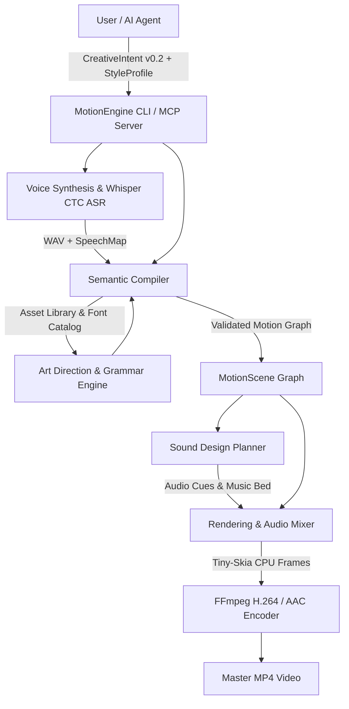

<div align="center">

# 🎬 MotionEngine

**Autonomous Editorial Motion Graphics & Video Generation Engine in Rust**

[](LICENSE)
[](https://www.rust-lang.org)
[]()

*Transform declarative semantic intent into broadcast-grade editorial motion graphics with synchronized narration, procedural typography, and reactive sound design.*

</div>

---

## 📖 Overview

**MotionEngine** is a deterministic, compiler-driven motion graphics engine built in Rust. Unlike generative video models that hallucinate text and produce blurry physics, MotionEngine operates as a **semantic compiler**:

1. **Authors define intent**: A declarative JSON (`CreativeIntent`) describing *what* each beat communicates (statements, data comparisons, numbers, and narration).
2. **Deterministic compilation**: MotionEngine resolves layouts, typography, safe areas, kinetic easing, and sound effects across multiple design genres (Documentary, Cinematic 3D, Editorial, Studio, Street).
3. **Word-level ASR alignment**: Speech audio is synthesized via TTS and aligned word-for-word using Whisper CTC, anchoring visual cuts, stamps, and stat cards exactly to spoken moments.
4. **Broadcast rendering**: Frames are rasterized via Tiny-Skia at 1080×1920 (or 1:1 / 16:9) at 30fps and encoded into master MP4 files via FFmpeg.

---

## 🎥 Showcase Samples

MotionEngine includes rendered sample cuts in the [`showcase/`](showcase/) directory demonstrating various styles and grammars:

| Sample Preview | Genre / Style | Key Features |
| :--- | :--- | :--- |
| **`documentary_money_720p.mp4`** | Documentary / Dossier | Vox-style data journalism, evidence clippings, stamps, and stat cards. |
| **`countdown_tense_720p.mp4`** | Kinetic / Tense | High-velocity countdown beats, audio-reactive hits, and kinetic typography. |
| **`layers_documentary_720p.mp4`** | Layers Grammar | Multi-tier conceptual breakdown with persistent depth focus. |
| **`short_state_change_720p.mp4`** | State Change Grammar | Directional velocity transitions and comparative before/after states. |

---

## 🏛️ System Architecture



### Workspace Crates

* **`motion-core`**: Core domain logic, schema definitions (`CreativeIntent`, `StyleProfile`, `MotionScene`), semantic layout grammars, typography, and animation easing.
* **`motion-render`**: High-performance CPU rasterizer built on Tiny-Skia, audio bus mixer, and FFmpeg video pipeline.
* **`motion-voice`**: Voice synthesis pipeline, OpenRouter / local TTS integration, and local Whisper ASR word-timing alignment.
* **`motion-cli`**: Command-line interface (`compile`, `render`, `voice`, `reel`, `validate`).
* **`motion-mcp`**: Model Context Protocol (MCP) server enabling AI coding assistants (Claude, Gemini, etc.) to author and render videos autonomously.

---

## ⚡ Prerequisites

* **Rust**: `1.80` or later ([rustup.rs](https://rustup.rs/))
* **FFmpeg**: `6.0` or later with `libx264` and `aac` enabled:
  ```bash
  # macOS (Homebrew)
  brew install ffmpeg

  # Ubuntu / Debian
  sudo apt-get install ffmpeg
  ```
* **TTS Provider (Optional)**:
  * For neural speech synthesis: an [OpenRouter](https://openrouter.ai/) API key (Fish Audio S2.1 Pro free tier supported).
  * For offline testing on macOS: the system `say` synthesizer is supported without any API key.

---

## 🚀 Installation & Setup

### 1. Build from Source

```bash
git clone https://github.com/abhishekaryan23/motion-engine.git
cd motion-engine

# Build release binaries with local ASR features enabled
cargo build --release --features asr-local,asr-ctc
```

The resulting binary will be at `target/release/motion-engine`. Add it to your `PATH` or create an alias:

```bash
export PATH="$PWD/target/release:$PATH"
```

### 2. Configure Voice Providers (Optional)

If using OpenRouter for neural voice synthesis:

```bash
# Set your API key securely
motion-engine providers set-key openrouter
# Paste your key when prompted
```

Alternatively, set the environment variable:
```bash
export OPENROUTER_API_KEY="sk-or-v1-..."
```

---

## 💻 Quick Start & CLI Usage

### Option A: The All-in-One `reel` Command

The fastest way to generate a complete video from intent to master MP4:

```bash
motion-engine reel examples/public/minimal-emphasize.intent.json \
  --style examples/public/minimal.style.json \
  -o output/minimal.mp4
```

### Option B: The Granular 3-Stage Pipeline

#### Step 1: Synthesize & Align Narration
```bash
motion-engine voice examples/topics/fuel.intent.json \
  -o output/voice/ \
  --tts-model fish \
  --align local \
  --asr-ctc on
```
*Outputs: `fuel.voice.wav` and `fuel.speech.json` (precise word-level timestamps).*

#### Step 2: Compile Semantic Motion Scene
```bash
motion-engine compile examples/topics/fuel.intent.json \
  --style examples/taste/editorial_warm.style.json \
  --speech output/voice/fuel.speech.json \
  --art dossier \
  -o output/fuel.motion.json
```
*Outputs: fully validated, frame-by-frame animation graph (`MotionScene`).*

#### Step 3: Render Master Video
```bash
motion-engine render output/fuel.motion.json \
  --speech output/voice/fuel.speech.json \
  --out-dir output/render/
```
*Outputs: broadcast MP4 encoded at 1080×1920 30fps.*

---

## 📝 Authoring Video Intents (`CreativeIntent` v0.2)

MotionEngine uses declarative JSON specifications. You state **what** the video communicates; the engine decides camera paths, typography sizes, and layout compositions.

### Minimal Example

```json
{
  "version": "0.2",
  "title": "coffee_facts",
  "format": "vertical",
  "beats": [
    {
      "purpose": "emphasize",
      "statement": "Morning ritual",
      "narration": "Over two billion cups of coffee are poured every single morning.",
      "primary": { "kind": "number", "value": "2.25B", "meaning": "cups per day" },
      "secondary": { "kind": "phrase", "value": "Worldwide", "meaning": "scale" },
      "energy": "impact",
      "keyword": "coffee"
    },
    {
      "purpose": "compare",
      "statement": "Nordic consumption",
      "narration": "Finland leads the world at twelve kilograms per person, while the US sits at four.",
      "primary":   { "kind": "object", "asset": "flag_finland", "value": "12 kg", "meaning": "Finland" },
      "secondary": { "kind": "object", "asset": "flag_us",      "value": "4.5 kg", "meaning": "United States" },
      "relationship": "separate",
      "energy": "building",
      "keyword": "highest"
    },
    {
      "purpose": "reveal",
      "statement": "The daily impact",
      "narration": "That cup is not just caffeine — it is a global trade network linking sixty countries.",
      "primary": { "kind": "number", "value": "60+", "meaning": "exporting nations" },
      "energy": "impact",
      "keyword": "global"
    }
  ]
}
```

### Supported Beat Purposes

* **`emphasize`**: Bold hook or core thesis; headline + hero figure card.
* **`compare`**: Direct head-to-head comparison between two stat cards with auto-drawn dividers.
* **`contrast`**: Tension / gap comparison with relationship connectors.
* **`reveal`**: Climactic takeaway; large display figure card with energetic entrance.
* **`explain`**: Definition or calm contextual breakdown.

### Structured Subject Types

* **`number`**: Numeric figures (`"value": "4.1%"`, `"$120"`, `"-15%"`). Renders in massive serif or grotesque display type.
* **`phrase`**: Text claims or labels.
* **`object`**: Pictured subject looked up in the asset library (`assets/library/`). Combined with `value`, becomes a **Stat Card**.
* **`collection`**: Multi-item lists. When carrying numeric values, automatically compiles into an **Animated Ranking Bar Chart**.

---

## 🎨 Art Direction & Style Profiles

Control visual tone via `StyleProfile`:

```json
{
  "tone": "documentary",
  "polarity": "dark",
  "temperature": "warm",
  "temperament": "balanced",
  "density": "balanced",
  "seed": 1
}
```

* **`tone`**: `documentary` (Vox/dossier evidence desk), `cinematic` (3D multiplane depth & bokeh), `studio` (bold studio cutouts & discs), `editorial` (warm magazine typography), `street` (urban poster collage), `playful` (bouncy energetic motion).
* **`polarity`**: `dark` or `light`.
* **`temperature`**: `warm` or `cool`.
* **`temperament`**: `restrained`, `balanced`, or `energetic`.

---

## 🤖 Model Context Protocol (MCP)

MotionEngine includes a first-class MCP server (`motion-mcp`) allowing AI coding agents (Claude Desktop, Antigravity, Cursor) to compose, check, and render videos autonomously.

### Claude Desktop Configuration

Add to your `claude_desktop_config.json`:

```json
{
  "mcpServers": {
    "motion-engine": {
      "command": "/path/to/motion-engine/target/release/motion-mcp",
      "args": ["--root", "/path/to/motion-engine"]
    }
  }
}
```

**Available MCP Tools:**
* `make_video`: End-to-end video creation with pre-flight check mode.
* `revise_video`: Targeted script and beat revisions.
* `view_frames`: Contact sheet inspection of rendered scenes.
* `find_assets`: Search library icons, props, and cutouts.
* `list_options`: Query available genres, tones, and music moods.

---

## 🧪 Verification & Smoke Tests

Run the built-in public interface smoke test:

```bash
bash scripts/public_smoke.sh
```

---

## 📄 License

Dual-licensed under either of:
* Apache License, Version 2.0 ([LICENSE](LICENSE) or http://www.apache.org/licenses/LICENSE-2.0)
* MIT License ([LICENSE-MIT](LICENSE) or http://opensource.org/licenses/MIT)

at your option.

---

## 🛡️ Security

Please report any security vulnerabilities via [GitHub Private Vulnerability Reporting](https://github.com/abhishekaryan23/motion-engine/security/advisories/new). See [SECURITY.md](SECURITY.md) for details.
