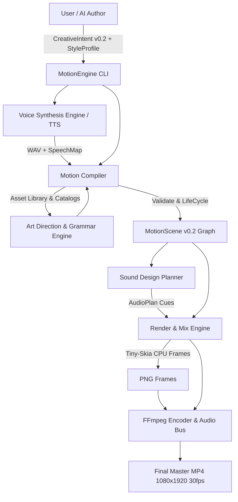
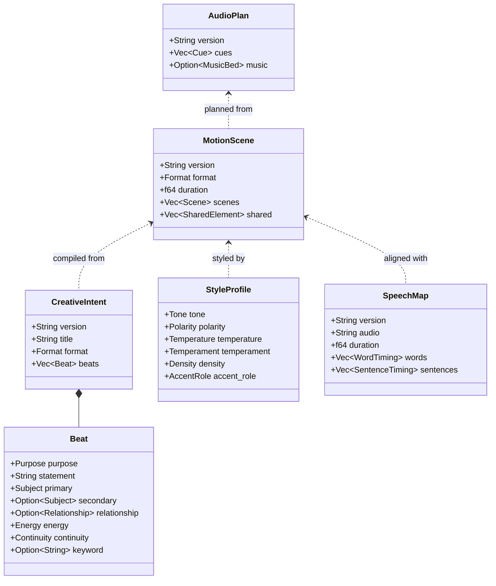

# MotionEngine Architecture & System Design

This document details the High-Level Design (HLD) and Low-Level Design (LLD) of the MotionEngine system.

---

## 1. High-Level Design (HLD)

MotionEngine translates high-level semantic intent into fully composed, broadcast-grade editorial motion graphics videos with synchronized narration and sound design.

---

## 2. Low-Level Design (LLD)

---

## 3. Pipeline Stages

1. **Semantic Intent (`CreativeIntent v0.2`)**: The author specifies *what* to communicate, *not* how to move or style.
2. **Taste Director (`StyleProfile`)**: Selects the palette, typography pairing, motion temperament, material, and density.
3. **Voice & Speech Synchronization (`motion-voice`)**: Speaks the statements, extracts word-level timings into `SpeechMap`, and anchors scene life-cycles.
4. **Art Direction & Asset Planner (`motion-core`)**: Identifies human and object entities, matches them against curated photographic and classical libraries, and produces an `AssetPlan`.
5. **Timeline & Frame Evaluation (`motion-render`)**: Resolves frame-by-frame primitives deterministically via `tiny-skia` and `cosmic-text`.
6. **Sound Design & Master Encoding (`motion-render::audio_mix`)**: Mixes foley sound cues and narration at -16.0 LUFS broadcast target with true peak control.
